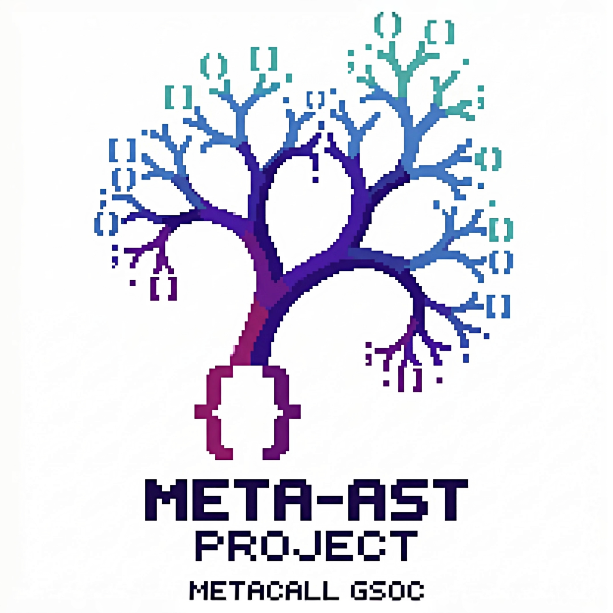

<div align="center">
  
  <p align="center"><strong>Standalone static analysis and dependency graph generator for polyglot source trees</strong></p>
</div>

---

`meta-ast` is a fast, standalone static analysis engine that parses multi-language projects, builds symbol-level dependency graphs, detects cyclic imports, and generates MetaCall deployment manifests. Written in Rust, powered by tree-sitter, with no runtime execution of user code.

Built as part of **Google Summer of Code 2026** for the **MetaCall** organization by **[Khaled Alam](https://github.com/k5602)**.

Supports **8 languages**: Python, JavaScript, TypeScript, TSX, C, C++, Rust, Go.

---

## Quick start

```bash
# Requires Rust toolchain - https://rustup.rs
git clone https://github.com/metacall/meta-ast.git
cd meta-ast
cargo build --release
```

The binary is at `./target/release/meta-ast`.

---

## Goals

`meta-ast` exists to give polyglot codebases a single, fast, language-agnostic
view of their structure without executing any user code. Its objectives:

- **Parse 8 languages with one tool.** Python, JavaScript, TypeScript, TSX, C,
  C++, Rust, and Go flow through a uniform tree-sitter pipeline. A mixed
  Python/JS/Rust project is one graph, not three glued together.
- **Normalize to a stable IR.** Every declaration becomes a `Symbol` with a
  consistent shape and a stable JSON/YAML output contract. Downstream tooling
  consumes results without caring about the source language.
- **Surface deployment structure.** Cross-file dependency graphs plus Tarjan
  SCC reveal cyclic import clusters and independent units. These feed the
  MetaCall Function Mesh deployment model via pod-based manifests.
- **Recover, never abort.** Partial or malformed trees are parsed as far as
  possible and any parse/extraction gaps are accumulated as diagnostics. A
  broken file never takes down the whole analysis.
- **Stay standalone and safe.** No runtime execution of target code, no network,
  no external services. Pure static analysis driven by CLI or library API.

---

## Scope

**In scope:**

- Syntactic symbol extraction (functions, classes, objects, methods, structs,
  enums, interfaces, namespaces) and their visibility/doc metadata.
- Cross-file import resolution, reference resolution, and dependency graph
  assembly with confidence-weighted edges.
- Cyclic-import detection (Tarjan SCC) and deployment-unit classification.
- MetaCall pod-based deployment manifest generation (`metacall.pods.json`) and
  Function Mesh annotation (`metacall.mesh.json`) behind the `metacall-deploy`
  feature.
- External dependency resolution: per-language lockfile/manifest parsing to
  pin dependencies with exact versions.
- Single-snapshot analysis of a directory tree via CLI or `analyze_graph`.

---

## Use cases

- **Architecture review & onboarding.** Get a normalized map of every symbol and
  its dependencies across a polyglot repo to understand structure quickly.
- **Cyclic dependency guard.** Run `meta-ast graph` in CI to fail builds that
  introduce accidental import cycles.
- **Deployment planning for MetaCall / Function Mesh.** The `deploy` subcommand
  turns detected cross-language `metacall_load_from_*` call sites and SCC units
  into manifests that drive co-deployment vs. independent-function decisions.
- **Documentation & visualization.** Emit an interactive Cytoscape.js dashboard
  (`--html`, loaded from a CDN and cached by the browser) to explore ownership, references,
  and deployment units visually.
- **Library integration.** Consume `meta-ast` as a crate: `analyze_graph`
  returns a `GraphAnalysis` (`CodeGraph` + `SccAnalysis`) for custom tooling,
  linters, or report generators.

---

## Subcommands

### `inspect`

Extracts all function, class, and object declarations from a codebase.

```bash
meta-ast inspect <path> [-f json|yaml] [-o output.json]
```

### `graph`

Builds the cross-file dependency graph, resolves imports, and runs Tarjan SCC to identify cyclic clusters and independent deployment units.

```bash
meta-ast graph <path> [-f json|yaml] [-o graph.json]
meta-ast graph <path> --html                    # interactive Cytoscape.js dashboard (CDN, browser-cached)
```

### `deploy` *(requires `--features metacall-deploy`)*

Scans for cross-language `metacall_load_from_*` call sites, resolves external dependencies from lockfiles and package manifests, partitions files into same-language pods, and generates deployment artifacts.

```bash
cargo build --release --features metacall-deploy

meta-ast deploy <path> --out ./out      # generate manifests
meta-ast deploy <path> --check          # CI validation: verify every cut edge has an RPC stub
```

Generates two artifacts:

| File | Description |
|---|---|
| `metacall.pods.json` | Pod manifest: language-based deployment units, inter-pod edges with confidence scores, per-pod dependency lists with pinned versions, and AST node metrics |
| `metacall.mesh.json` | SCC-derived Function Mesh topology annotation with cross-language call-site attribution |

See [docs/DEPLOY.md](docs/DEPLOY.md) for scanner details, confidence scoring, pod partitioning, manifest schema, and the fairness check used in CI.

---

## Documentation

| Document | Description |
|---|---|
| [docs/ARCHITECTURE.md](docs/ARCHITECTURE.md) | High-level pipeline and component boundaries |
| [docs/STRUCTURE.md](docs/STRUCTURE.md) | Module layout, data structures, design patterns |
| [docs/DEPLOY.md](docs/DEPLOY.md) | Deploy module: scanner, manifests, mesh annotation |
| [docs/ROADMAP.md](docs/ROADMAP.md) | Phase-by-phase delivery plan |
| [docs/adr/](docs/adr/) | Architecture Decision Records |
| [docs/rfcs/](docs/rfcs/) | Design RFCs |
| [docs/specs/](docs/specs/) | Requirements and traceability |

---

## Roadmap

- **Phase 4 (In Progress)**: Watch mode, incremental analysis, C ABI.
- **Phase 5 (Complete)**: `metacall-deploy` - call-site scanning, pod partitioning, dependency resolution, pod manifests, Function Mesh annotation, fairness checking.
- **Phase 6 (Planned)**: Language expansion (C#, Java).

Full details in [docs/ROADMAP.md](docs/ROADMAP.md).

---

## Benchmarking

Performance is measured with [criterion](https://github.com/japaric/criterion.rs)
via two benchmark suites (`harness = false`):

- `benches/pipeline.rs` - end-to-end extraction across the per-language fixtures
  (python, javascript, typescript, tsx, rust, go, c, cpp, mixed).
- `benches/graph.rs` - graph construction, Tarjan SCC on varied topologies
  (acyclic chains, single/multiple cycles, dense graphs), edge deduplication,
  and node lookup at scale (up to 10k nodes / 10k duplicates).

Run them locally:

```bash
cargo bench                                    # all suites
cargo bench --bench pipeline                   # extraction only
cargo bench --bench graph -- --plotting-backend=plotters
```

Benchmarks run on the fixture corpus under `tests/fixtures/`, so results scale
with that corpus. Typical wall-clock figures (your hardware will vary):

- Per-language extraction of the fixture set completes in low milliseconds.
- SCC and node lookup stay sub-millisecond into the thousands-of-nodes range;
  edge deduplication is linear in the duplicate count.

For reproducible CI numbers, pin the toolchain (MSRV 1.92.0) and run on a
quiet machine; criterion reports mean/stddev and supports `--save-baseline` for
regression tracking.

---

## License

Apache License, Version 2.0. See `LICENSE` for details.
