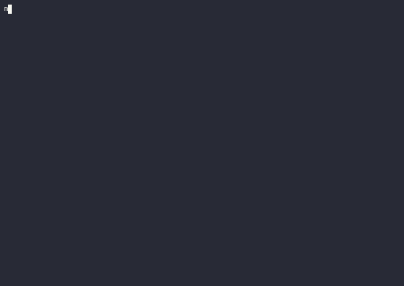
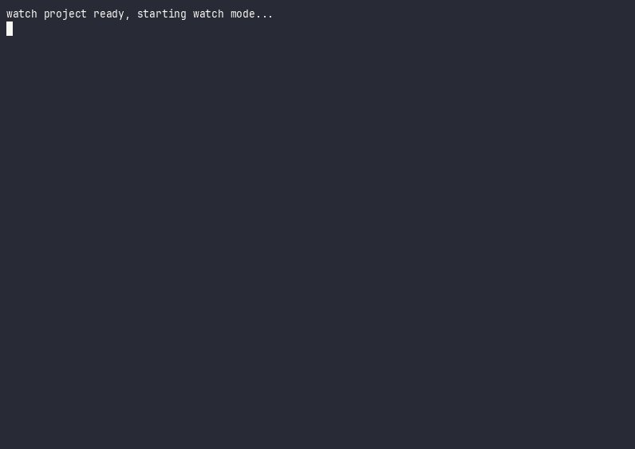

# Demo

This page walks the delivered artifacts end to end. The animated GIFs below
were recorded from the real CLI against the fixture trees in this repository.
Each GIF shows the command being typed and its actual output.

## Intro

Version, help, and a first `inspect` run over the Python fixtures:



## Graph

Cross-language dependency graph with SCC analysis over the
`tests/fixtures/mixed/three_lang_math` project (Python orchestrator, JS and
Rust workers), first as JSON then as YAML:


## Deploy

`metacall-deploy` manifest generation for the same project, producing
`metacall.pods.json` and `metacall.mesh.json`:


## Watch mode

Debounced incremental re-analysis: the watch loop prints a fresh graph
snapshot on every tick. An edit to `main.py` adds a function, and the next
snapshot picks up the new symbol (`node_count` grows, `snapshot_id`
increments) without a full re-parse of unchanged files:



## Try it yourself

```bash
git clone https://github.com/metacall/meta-ast.git
cd meta-ast
cargo build --release --all-features

./target/release/meta-ast inspect tests/fixtures/python
./target/release/meta-ast graph tests/fixtures/mixed/three_lang_math --html
./target/release/meta-ast deploy tests/fixtures/mixed/three_lang_math --out ./deploy-out
```
